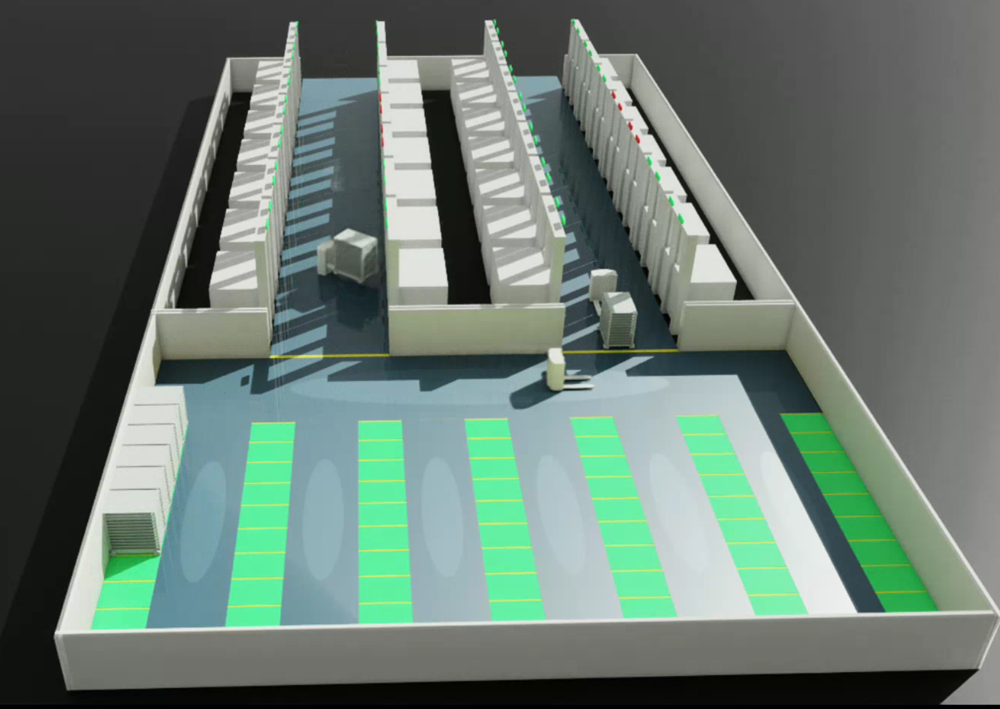

# 烘干生产线 AGV 路径规划与 Isaac Sim 仿真

# Isaac Sim AGV Drying Line Simulation

<p align="center">
  
</p>

An AGV routing, scheduling, and action-level simulation project for an industrial drying production line in Isaac Sim.

本仓库用于展示烘干生产线中多台 AGV 搬运烘车的流程仿真。项目包含烘箱、AGV、烘车 URDF/STL 模型，使用 Python 脚本生成 Isaac Sim USD 场景，并通过时间采样动画播放完整生产节拍。

当前仿真的重点是产线布局、路径流程、调度逻辑和可视化展示，不是实时闭环控制或物理接触动力学验证。

## 🎬 Demo Video

A full task execution demo is available in the project release:

➡️ [Download / View Demo Video](../../releases/tag/V1.0)

## 功能概览

- 生成包含 4 排烘箱、进料区、冷却区和 AGV 通道的烘干生产线场景。
- 展示北、南两条烘干走廊的 AGV 入库、出库和交接流程。
- 展示冷却区 AGV 接车并按车位编号停车。
- 烘箱门、LED 状态、AGV 位姿、货叉升降、烘车可见性均写入 USD time samples。
- 提供主流程场景和一个独立的 AGV 抬叉转向测试场景。

## 目录结构

```text
.
├── README.md
├── docs/
│   ├── path_planning_and_simulation_report.md
│   └── key_code_snippets.md
├── scripts/
│   ├── create_oven_room_scene.py
│   └── launch_process_visualization.py
├── scenes/
│   └── oven_room.usd
├── oven/
├── F4-1000C/
└── 烘车urdf/
```

主要文件说明：

| 路径 | 说明 |
| --- | --- |
| `scripts/create_oven_room_scene.py` | 生成主场景 `scenes/oven_room.usd` |
| `scripts/launch_process_visualization.py` | 在 Isaac Sim GUI 中打开主场景并循环播放 |
| `docs/path_planning_and_simulation_report.md` | 项目流程、布局、调度和仿真实现说明 |
| `docs/key_code_snippets.md` | 报告用关键代码和 URDF 片段 |
| `oven/` | 最终主流程使用的烘箱 URDF 和网格 |
| `F4-1000C/` | AGV URDF 和网格 |
| `烘车urdf/` | 烘车 URDF 和网格 |

## 环境要求

- Ubuntu/Linux 桌面环境
- NVIDIA GPU 和可用图形驱动
- Isaac Sim 或包含 Isaac Sim Python API 的环境
- Python 3.10/3.11，具体版本以 Isaac Sim 环境为准

本项目依赖 Isaac Sim 的 Python API，例如 `isaacsim`、`omni.usd`、`pxr` 等模块。普通系统 Python 通常无法直接运行这些脚本，需要使用 Isaac Sim 自带 Python 或已配置好的 Isaac Sim/IsaacLab conda 环境。

## 快速运行

如果已经有生成好的场景，可以直接打开可视化：

```bash
/path/to/isaac-sim/python.sh scripts/launch_process_visualization.py
```

在本地 IsaacLab 环境中也可以类似运行：

```bash
/home/your-user/anaconda3/envs/env_isaaclab/bin/python scripts/launch_process_visualization.py
```

成功运行后终端会输出类似：

```text
Opened scene: .../scenes/oven_room.usd
Default prim: /World
Animation: 0 - 1100.0s (looping)
```

## 重新生成主场景

```bash
/path/to/isaac-sim/python.sh scripts/create_oven_room_scene.py
```

无界面生成：

```bash
/path/to/isaac-sim/python.sh scripts/create_oven_room_scene.py --headless
```

只使用简化占位几何快速检查布局：

```bash
/path/to/isaac-sim/python.sh scripts/create_oven_room_scene.py --proxy-only
```

默认输出：

```text
scenes/oven_room.usd
```

## 实现边界

当前主流程采用“离线生成场景 + USD 时间采样动画”的方式实现。脚本会先计算任务节拍、路径点、门状态、LED 状态和车辆轨迹，再写入 USD 文件，Isaac Sim 负责播放时间线。

因此，当前版本适合用于：

- 课程设计展示
- 产线空间布局说明
- AGV 搬运流程可视化
- 调度节拍和路径流程说明
- 报告配图和演示视频录制

当前版本不等价于：

- 实时闭环路径规划系统
- 基于真实传感器反馈的定位和避障系统
- 完整物理接触、轮地摩擦和叉车载荷动力学验证

## 发布内容说明

本发布目录只保留复现主流程所需的源码、文档、USD 场景和模型资产。原始工程中的压缩包、导出日志、Python 缓存、测试场景、测试脚本、旧版 `oven_urdf` 导出资产和未被主流程引用的大型临时模型均未纳入发布目录。
